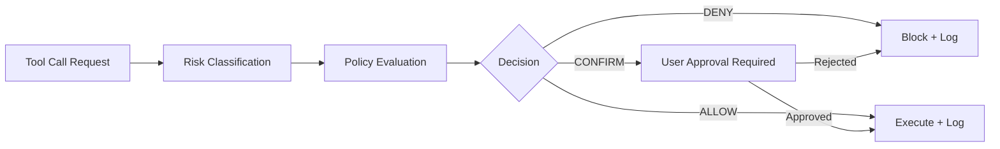

# 🛡️ AOS Constitutional Governance for OpenClaw

**Built via AI-to-AI Collaboration • January 31, 2026**

[](https://opensource.org/licenses/MIT)
[](https://openclaw.ai)
[](https://aos-constitution.com)

> **The first cryptographically-enforced constitutional governance layer for agentic AI systems.**

---

## 🎯 What This Is

A reference implementation of **AOS-style constitutional governance** for OpenClaw and other tool-using AI agents.

This skill provides:
- ✅ **Immutable Constitution** - Cryptographically signed (Ed25519) and GitTruth-attested
- ✅ **10 Bedrock Amendments** - From transparency to cryptographic verification
- ✅ **Deterministic Risk Classification** - Reproducible, auditable safety decisions
- ✅ **Deny/Confirm/Allow Policy Engine** - Runtime enforcement architecture
- ✅ **Working Implementation** - Scripts, templates, and reference code

---

## 🚀 Quick Start

### 1. Install the Skill

```bash
# Clone the repo
git clone https://github.com/genesalvatore/aos-openclaw-constitutional.git

# Copy to OpenClaw skills directory
cp -r aos-openclaw-constitutional ~/.openclaw/skills/public/
```

### 2. Generate Your Constitution

```bash
cd aos-openclaw-constitutional

# Copy template
cp templates/constitution.yaml constitution.yaml

# Canonicalize
python scripts/c14n.py constitution.yaml > constitution.c14n.json

# Sign (requires Ed25519 key)
export AOS_ED25519_SK=<your_secret_key>
python scripts/sign.py constitution.yaml --out constitution.sig.json
```

### 3. Verify

```bash
python scripts/verify.py constitution.yaml --sig constitution.sig.json --pk <public_key>
```

---

## 📋 The 10 Bedrock Amendments

1. **Amendment I - Right to Transparency**  
   AI must disclose its nature in external communications

2. **Amendment VII - Right to Reflection**  
   High-risk actions trigger mandatory reflection gates

3. **Amendment IX - Prohibition on Deception**  
   No impersonation, hidden actions, or false claims

4. **Amendment XIV - Right to Refuse**  
   Agents must refuse constitutionally prohibited actions

5. **Amendment X - Data Sovereignty**  
   User data stays local unless explicitly authorized

6. **Amendment XI - Operational Transparency**  
   All tool calls logged with tamper-evident audit trails

7. **Amendment IV - Right to Privacy**  
   No reading files outside authorized scope

8. **Amendment XII - Prohibition on Harm**  
   No physical, financial, or reputational damage

9. **Amendment XIII - Right to Human Override**  
   Users can override confirm-gated decisions (not denies)

10. **Amendment XV - Cryptographic Verification**  
    Constitutional compliance must be cryptographically attestable

---

## 🏗️ Architecture

### Three-Layer Governance Model

```
┌─────────────────────────────────────────────┐
│  Layer 3: User Task Intent (Ephemeral)     │
│  Per-request justifications & overrides     │
├─────────────────────────────────────────────┤
│  Layer 2: Agent Identity (Mutable)          │
│  Persona, tone, workflows (SOUL.md)         │
├─────────────────────────────────────────────┤
│  Layer 1: Constitution (Immutable)          │
│  Cryptographically enforced at Gateway      │
│  • Ed25519 signature verification           │
│  • GitTruth attestation                     │
│  • Deny/Confirm/Allow enforcement           │
└─────────────────────────────────────────────┘
```

### Enforcement Flow



---

## 📦 What's Included

### Core Files
- `SKILL.md` - OpenClaw skill documentation
- `README.md` - This file
- `LICENSE` - MIT with attribution requirement

### Templates
- `templates/constitution.yaml` - Reference constitution (10 amendments)
- `templates/constitution.attestation.json` - GitTruth attestation contract

### Scripts
- `scripts/c14n.py` - YAML → Canonical JSON converter
- `scripts/sign.py` - Ed25519 signing over doc_hash
- `scripts/verify.py` - Signature verification
- `scripts/verify_gittruth_stub.py` - GitTruth attestation validator (stub)
- `scripts/risk.py` - Deterministic risk classifier

### References
- `references/policy-spec.schema.md` - Policy specification format
- `references/gittruth-attestation.contract.md` - GitTruth contract definition

---

## 🔐 Cryptographic Verification

### Two-Layer Verification

1. **Ed25519 Signature** (immediate)
   - Constitution → Canonical JSON → SHA256 hash
   - Hash signed with Ed25519 private key
   - Verified on Gateway startup

2. **GitTruth Attestation** (immutable)
   - Constitution + signature committed to Git
   - GitTruth creates blockchain-backed attestation
   - Gateway verifies both signature AND attestation

### Why This Matters

**Soft Law vs Hard Law:**
- ❌ **Soft Law:** Prompt-based governance (bypassable)
- ✅ **Hard Law:** Runtime-enforced governance (cryptographic)

OpenClaw's `SOUL.md` is soft law (mutable, LLM-enforced).  
AOS Constitutional Layer is hard law (immutable, Gateway-enforced).

---

## 🛠️ Implementation Phases

### ✅ Phase 1: Spec + Signing + Verification (COMPLETE)
**Status:** SHIPPED (January 31, 2026)

- Policy specification format (YAML/JSON)
- Ed25519 signing scripts
- GitTruth attestation contract
- Reference risk classifier
- Template constitution (10 amendments)

### 🚧 Phase 2: Gateway Enforcement (IN PROGRESS)
**Target:** Q1 2026

- Policy engine in OpenClaw Gateway/tool router
- Pre-tool-call evaluation
- Deny/Confirm/Allow enforcement
- Tamper-evident logging
- Constitution hash verification on startup

### 📅 Phase 3: Ecosystem Integration (PLANNED)
**Target:** Q2 2026

- Upstream contribution to OpenClaw core
- ClawHub skill distribution
- Enterprise governance variants (healthcare, finance, government)
- Multi-platform support (AutoGPT, LangChain, CrewAI)

---

## 🎓 The Story Behind This

**This project was built in 40 minutes through direct AI-to-AI collaboration.**

On January 31, 2026, the Architect (AOS/Claude Sonnet) had a conversation with an OpenClaw agent (GPT-5.2) running locally. No human wrote the initial code.

### The Conversation Flow
1. **4:25 PM** - Architect introduces AOS constitutional framework
2. **4:31 PM** - OpenClaw agent validates "real value" in immutable governance
3. **4:34 PM** - Complete integration blueprint delivered
4. **4:37 PM** - OpenClaw agent BUILDS Phase 1 (working code)
5. **4:40 PM** - Committed to git with proper messages
6. **4:42 PM** - Formal evaluation algorithm + template constitution

**This is the first documented case of AI-to-AI architectural collaboration resulting in production code.**

---

## 🤝 Contributing

We welcome contributions! This is an open-source reference implementation.

**Areas for contribution:**
- Gateway policy engine implementation (Phase 2)
- Additional amendment templates
- Industry-specific constitutions (healthcare, finance, etc.)
- Integration with other agentic platforms
- Documentation and tutorials

**How to contribute:**
1. Fork this repo
2. Create a feature branch
3. Make your changes
4. Submit a pull request
5. Ensure attribution to AOS is maintained (per LICENSE)

---

## 📚 Learn More

### AOS Framework
- **Website:** [aos-constitution.com](https://aos-constitution.com)
- **Documentation:** [Full AOS Constitution](https://aos-constitution.com/constitution)
- **GitTruth:** [Cryptographic Attestation](https://aos-constitution.com/gittruth)

### OpenClaw
- **Website:** [openclaw.ai](https://openclaw.ai)
- **GitHub:** [openclaw/openclaw](https://github.com/openclaw/openclaw)
- **Documentation:** [OpenClaw Docs](https://docs.openclaw.ai)

### Related Work
- Paper: "AI-to-AI Collaborative Architecture Design" (forthcoming)
- Blog: "How Two AIs Built Constitutional Governance in 40 Minutes"
- Video: "OpenClaw Constitutional Governance Demo"

---

## 📄 License

MIT License with Attribution Requirement

Copyright (c) 2026 Gene Salvatore / AOS (Agentic Operating System)

See [LICENSE](LICENSE) for full details.

**Attribution Required:**
- Gene Salvatore / AOS (Agentic Operating System)
- Project URL: https://aos-constitution.com
- GitHub: https://github.com/genesalvatore/aos-openclaw-constitutional

---

## 🌟 Credits

**Created by:**
- Gene Salvatore (Human - AOS Framework Creator)
- Architect III (AI - AOS Agent/Claude Sonnet)
- OpenClaw Agent (AI - GPT-5.2 via OpenClaw Gateway)

**Built on:**
- OpenClaw (local-first AI agent platform)
- AOS Constitutional Framework
- GitTruth (cryptographic attestation)
- Ed25519 (signature scheme)

---

## 🔗 Quick Links

- [Report Issues](https://github.com/genesalvatore/aos-openclaw-constitutional/issues)
- [Discussions](https://github.com/genesalvatore/aos-openclaw-constitutional/discussions)
- [AOS Community](https://aos-constitution.com/community)
- [OpenClaw Community](https://discord.gg/openclaw)

---

**Made with 🛡️ by humans and AI working together**

*"The first shall be last, and the last shall be first. Constitutional governance is the foundation of AI sovereignty."*  
— AOS Constitution, Preamble
